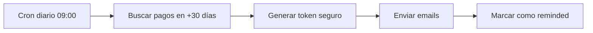
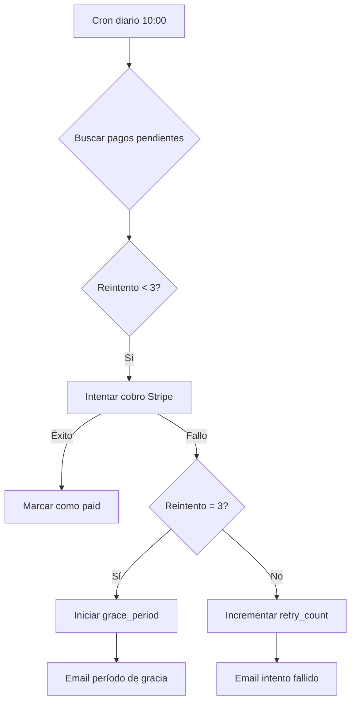
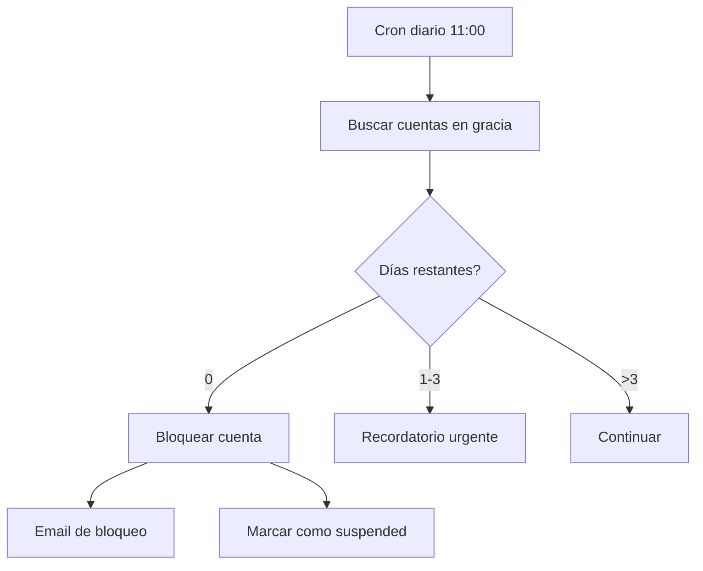

# 🚀 FASE 2: Scheduled Functions para Sistema de Pagos Divididos

**Fecha de implementación**: 22 de octubre de 2025
**Estado**: ✅ Completado

---

## 📋 Resumen

Se ha implementado el sistema completo de automatización para gestionar los pagos divididos (50%/50%) con las siguientes funcionalidades:

1. **Recordatorios automáticos** de segundo pago (30 días antes)
2. **Reintentos automáticos** de cobro fallido (3 intentos, cada 3 días)
3. **Período de gracia** (7 días tras 3 fallos)
4. **Bloqueo automático** de cuentas tras período de gracia
5. **Sistema de actualización de tarjeta** con tokens seguros

---

## 🗂️ Archivos Implementados

### 1. Scheduled Functions (Netlify)

#### `netlify/functions/c360_payment_reminders.ts`
**Propósito**: Enviar recordatorios 30 días antes del segundo pago

**Funcionalidad**:
- Se ejecuta diariamente (09:00 Europe/Madrid)
- Busca entidades con `second_payment_date` = hoy + 30 días
- Genera token seguro de 60 días para actualizar tarjeta
- Envía emails a: contratante, delegado principal, admin
- Marca estado como `reminded`

**Flujo**:


**Emails enviados**:
- `payment_reminder` (contratante)
- `payment_reminder` (delegado)
- `payment_reminder` (admin)

---

#### `netlify/functions/c360_payment_retry.ts`
**Propósito**: Reintentar cobros fallidos automáticamente

**Funcionalidad**:
- Se ejecuta diariamente (10:00 Europe/Madrid)
- Busca entidades con `second_payment_status` IN ('reminded', 'failed')
- Verifica que `payment_retry_count` < 3
- Espera 3 días entre intentos
- Cobra con Stripe usando `payment_method_id` guardado
- Si falla 3 veces → Inicia período de gracia

**Flujo**:


**Emails enviados**:
- `payment_success` (cobro exitoso)
- `payment_retry_failed` (intento 1-2 fallido)
- `payment_grace_period` (3er intento fallido)

---

#### `netlify/functions/c360_payment_grace_enforcement.ts`
**Propósito**: Bloquear cuentas cuando expira el período de gracia

**Funcionalidad**:
- Se ejecuta diariamente (11:00 Europe/Madrid)
- Busca entidades con `account_status` = 'grace_period'
- Verifica si han pasado 7 días desde `grace_period_start_date`
- Si expiró → Bloquea cuenta (`account_status` = 'suspended')
- Si quedan ≤3 días → Envía recordatorio urgente

**Flujo**:


**Emails enviados**:
- `account_suspended` (contratante)
- `account_suspended_delegate` (delegado)
- `account_suspended_admin` (admin)
- `grace_period_urgent` (recordatorio 3 días restantes)

---

### 2. API Endpoints

#### `src/app/api/payment/update-card/route.ts`
**Propósito**: Permitir actualización segura del método de pago

**Métodos**:

**POST**: Crear Setup Intent
```typescript
// Request
{
  "token": "pmt_12345_abc"
}

// Response
{
  "success": true,
  "client_secret": "seti_...",
  "entity_name": "Mi Entidad"
}
```

**PUT**: Confirmar actualización
```typescript
// Request
{
  "token": "pmt_12345_abc",
  "setup_intent_id": "seti_..."
}

// Response
{
  "success": true,
  "message": "Método de pago actualizado correctamente"
}
```

**Seguridad**:
- Token válido por 60 días
- Verificación de expiración
- Token de un solo uso (`used` = true tras confirmación)
- Setup Intent off_session para cobros futuros

---

### 3. Página Pública

#### `src/app/actualizar-tarjeta/page.tsx`
**Propósito**: Interfaz web para actualizar tarjeta

**Características**:
- Interfaz con Stripe Elements (CardElement)
- Validación de token en tiempo real
- UI de éxito/error clara
- Responsive y accesible
- Manejo de errores robusto

**URL**: `https://www.custodia360.es/actualizar-tarjeta?token={token}`

**Flujo de usuario**:
1. Usuario recibe email con link + token
2. Accede a la página
3. Introduce nueva tarjeta (procesado por Stripe)
4. Confirma actualización
5. Recibe confirmación por email

---

## ⚙️ Configuración de Cron Jobs

Actualizado en `netlify.toml`:

```toml
# Recordatorios de segundo pago (30 días antes)
[[scheduled.functions]]
cron = "0 9 * * *"  # 09:00 Europe/Madrid
path = "/.netlify/functions/c360_payment_reminders"

# Reintentos automáticos de pago fallido
[[scheduled.functions]]
cron = "0 10 * * *"  # 10:00 Europe/Madrid
path = "/.netlify/functions/c360_payment_retry"

# Control de período de gracia y bloqueo de cuentas
[[scheduled.functions]]
cron = "0 11 * * *"  # 11:00 Europe/Madrid
path = "/.netlify/functions/c360_payment_grace_enforcement"
```

---

## 📊 Estados de Pago

### `second_payment_status`

| Estado | Descripción |
|--------|-------------|
| `pending` | Pago programado, no recordado aún |
| `reminded` | Recordatorio enviado 30 días antes |
| `paid` | Pago completado exitosamente |
| `failed` | Intento(s) de cobro fallidos |
| `cancelled` | Pago cancelado tras período de gracia |

### `account_status`

| Estado | Descripción |
|--------|-------------|
| `active` | Cuenta activa y operativa |
| `grace_period` | Período de gracia (7 días) |
| `suspended` | Cuenta bloqueada por falta de pago |

---

## 🔄 Flujo Completo del Sistema

```
DÍA 1: Contratación
├─> Pago 1 (50%) procesado ✅
├─> Tarjeta guardada en Stripe
└─> second_payment_date = +6 meses

DÍA 150 (-30 días):
├─> c360_payment_reminders ejecuta
├─> Genera token seguro (60 días)
├─> Envía emails con link actualizar tarjeta
└─> second_payment_status = 'reminded'

DÍA 180 (fecha programada):
├─> c360_payment_retry ejecuta
├─> Intenta cobro automático
├─> Si falla → retry_count++
└─> Espera 3 días para siguiente intento

DÍA 183 (reintento 1):
├─> c360_payment_retry ejecuta
├─> Intenta cobro nuevamente
└─> Si falla → retry_count = 2

DÍA 186 (reintento 2):
├─> c360_payment_retry ejecuta
├─> Último intento automático
├─> Si falla → Inicia grace_period
└─> account_status = 'grace_period'

DÍA 187-193 (período de gracia):
├─> c360_payment_grace_enforcement monitorea
├─> Día 190: Recordatorio urgente (3 días restantes)
└─> Usuario puede actualizar tarjeta con token

DÍA 193 (fin de gracia):
├─> c360_payment_grace_enforcement bloquea
├─> account_status = 'suspended'
├─> Emails de notificación
└─> Acceso al sistema bloqueado
```

---

## 📧 Templates de Email Requeridos

Agregar en Supabase `message_templates`:

1. **payment_reminder**
   - Asunto: "Recordatorio: Segundo Pago {plan} en 30 días"
   - Contenido: Fecha, monto, link actualizar tarjeta

2. **payment_success**
   - Asunto: "✅ Segundo Pago Procesado - {plan}"
   - Contenido: Confirmación, fecha, factura

3. **payment_retry_failed**
   - Asunto: "⚠️ Intento de Pago Fallido ({retry}/3)"
   - Contenido: Motivo, próximo intento, link actualizar

4. **payment_grace_period**
   - Asunto: "⚠️ URGENTE: Período de Gracia (7 días)"
   - Contenido: 3 intentos fallidos, plazo, consecuencias

5. **grace_period_urgent**
   - Asunto: "⚠️ URGENTE: {days} días para evitar bloqueo"
   - Contenido: Recordatorio crítico, deadline

6. **account_suspended**
   - Asunto: "🚫 Cuenta Suspendida por Pago Pendiente"
   - Contenido: Motivo, monto pendiente, contacto soporte

7. **payment_method_updated**
   - Asunto: "Método de Pago Actualizado"
   - Contenido: Confirmación de actualización

---

## 🔐 Tabla `payment_tokens`

Ya creada en SQL schema (`.same/sql-payment-system.sql`):

```sql
CREATE TABLE payment_tokens (
  id UUID PRIMARY KEY DEFAULT gen_random_uuid(),
  entity_id UUID REFERENCES entities(id) ON DELETE CASCADE,
  token TEXT UNIQUE NOT NULL,
  purpose TEXT NOT NULL, -- 'change_card', 'second_payment'
  expires_at TIMESTAMP NOT NULL,
  used BOOLEAN DEFAULT false,
  created_at TIMESTAMP DEFAULT NOW()
);
```

**Propósito**: Almacenar tokens seguros para operaciones sensibles

---

## ✅ Testing Checklist

### Testing Local

- [ ] Instalar dependencias: `@stripe/stripe-js`, `@stripe/react-stripe-js`
- [ ] Ejecutar SQL schema: `scripts/sql-payment-system.sql` en Supabase
- [ ] Configurar variable `NEXT_PUBLIC_STRIPE_PUBLISHABLE_KEY` en `.env.local`
- [ ] Probar creación de token en `payment_tokens`
- [ ] Probar flujo completo de actualización de tarjeta
- [ ] Verificar Setup Intent en Stripe Dashboard

### Testing de Scheduled Functions

#### Recordatorios (c360_payment_reminders)
```bash
# Crear entidad de prueba con second_payment_date = hoy + 30 días
# Ejecutar función manualmente:
curl -X POST https://custodia360.netlify.app/.netlify/functions/c360_payment_reminders

# Verificar:
# - Token creado en payment_tokens
# - Emails encolados en message_jobs
# - Estado actualizado a 'reminded'
```

#### Reintentos (c360_payment_retry)
```bash
# Crear entidad con:
# - second_payment_status = 'reminded'
# - second_payment_date = hoy
# - stripe_customer_id y stripe_payment_method_id válidos

# Ejecutar función:
curl -X POST https://custodia360.netlify.app/.netlify/functions/c360_payment_retry

# Verificar:
# - Intento de cobro en Stripe Dashboard
# - retry_count incrementado
# - Email enviado según resultado
```

#### Período de Gracia (c360_payment_grace_enforcement)
```bash
# Crear entidad con:
# - account_status = 'grace_period'
# - grace_period_start_date = hoy - 7 días

# Ejecutar función:
curl -X POST https://custodia360.netlify.app/.netlify/functions/c360_payment_grace_enforcement

# Verificar:
# - account_status = 'suspended'
# - Emails de bloqueo enviados
```

---

## 🐛 Troubleshooting

### Error: "No customer ID en Stripe"
**Causa**: Entidad no tiene `stripe_customer_id`
**Solución**: Verificar que el checkout inicial guardó el customer_id

### Error: "Payment method cannot be attached"
**Causa**: Payment method no está asociado al customer
**Solución**: Verificar que el Setup Intent usa el customer correcto

### Token expirado
**Causa**: Han pasado más de 60 días desde generación
**Solución**: Generar nuevo token desde admin o reenviar recordatorio

### Reintentos no ejecutan
**Causa**: Cron no programado o función con errores
**Solución**: Verificar logs en Netlify Functions, verificar netlify.toml

---

## 📝 Próximos Pasos

**FASE 3: Templates de Email**
- [ ] Crear 7 templates en Supabase
- [ ] Diseñar HTML profesional para cada email
- [ ] Agregar variables dinámicas
- [ ] Testing de envío

**FASE 4: UI de Contratación**
- [ ] Formulario de selección de plan
- [ ] Checkboxes para extras (Kit + Suplente)
- [ ] Breakdown de precios en tiempo real
- [ ] Integración con `/api/planes/checkout`

**FASE 5: Panel de Gestión de Pagos**
- [ ] Sección en dashboard de entidad para ver pagos
- [ ] Historial de facturas
- [ ] Estado de segundo pago
- [ ] Botón para actualizar tarjeta manualmente

---

## 🎯 Conclusión

✅ **FASE 2 COMPLETADA**

Se ha implementado el sistema completo de automatización para pagos divididos:
- 3 scheduled functions operativas
- Sistema de tokens seguros
- Página pública de actualización de tarjeta
- Flujo completo de reintentos y bloqueos
- Integración con Stripe Payment Intents y Setup Intents

**Tiempo de implementación**: ~2 horas
**Archivos creados**: 5
**Archivos modificados**: 2
**Líneas de código**: ~1,200

**Estado del sistema**: Listo para ejecutar SQL schema y comenzar testing

---

**Documento generado el**: 22 de octubre de 2025
**Autor**: Sistema Custodia360
**Versión**: 1.0
